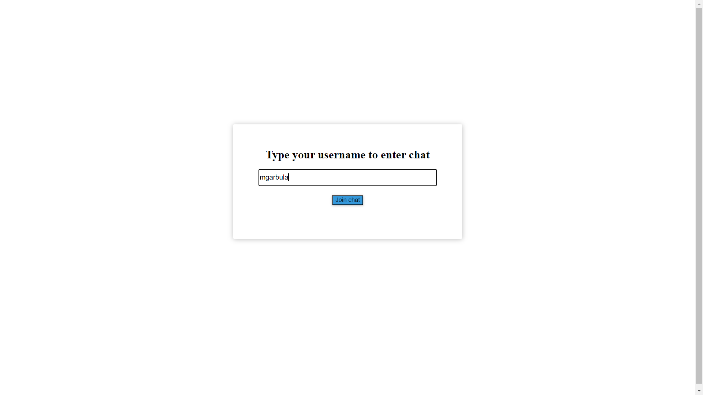
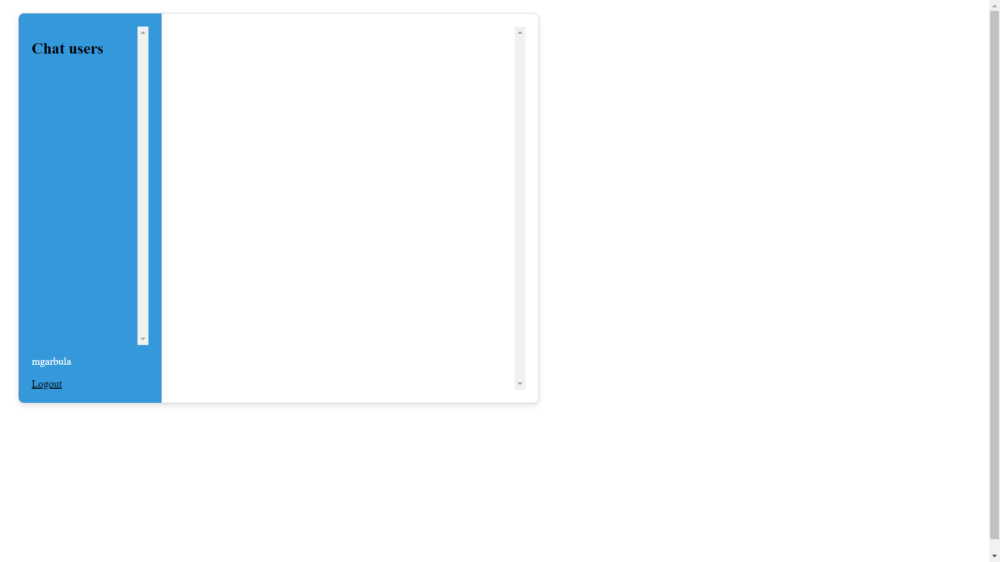
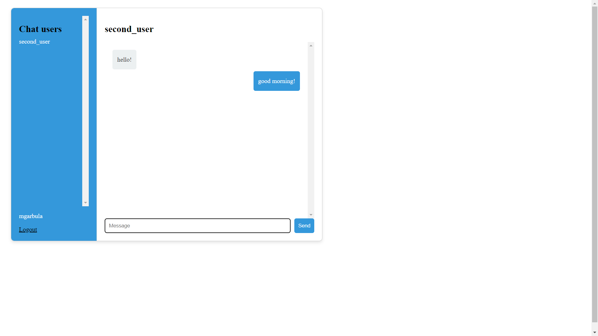
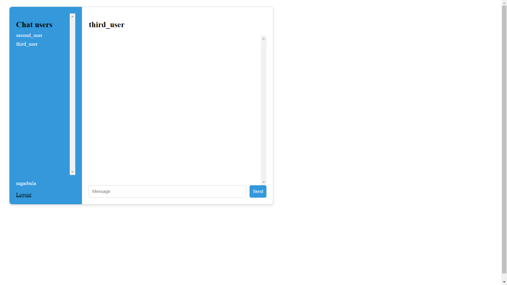

# Chat application

One on one chat application with group creation.
Chat uses STOMP and WebSocket protocols to serve messages.

It also uses couple of REST endpoints, especially to deal with login, logout and getting messages.

Login page

Chat page with messages

HTML and CSS files are inspired by https://github.com/ali-bouali/one-to-one-chat-spring-boot-web-socket

